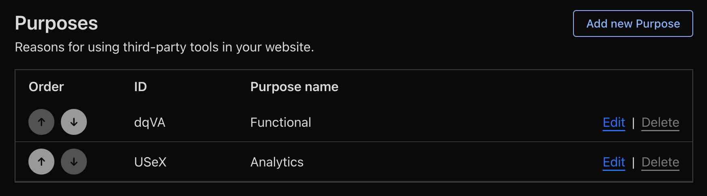

# Sentry Zaraz Consent Integration

[](https://badge.fury.io/js/sentry-zaraz-consent-integration)
[](https://opensource.org/licenses/MIT)

A TypeScript integration that dynamically adjusts Sentry configuration based on Cloudflare Zaraz consent preferences, ensuring GDPR and privacy compliance while maintaining optimal error tracking and performance monitoring.

**🌐 [Live Demo](https://pod666.github.io/sentry-zaraz-consent-integration/)**

## Features

- **🎯 Purpose-based Configuration**: predefined Map Zaraz consent purposes to specific Sentry features
- **⚡ Real-time Updates**: Automatically adjust Sentry settings when consent changes
- **📦 Event Queuing**: Queue events during consent determination, process when granted
- **🛡️ Privacy Compliant**: Respect user consent for different data processing purposes
- **🔧 Configurable**: Flexible purpose mapping and timeout settings
- **📊 Debug Support**: Comprehensive logging for troubleshooting

## Quick Start

### Installation

```bash
npm install sentry-zaraz-consent-integration
```

**Note**: This package requires `@sentry/react` (or another Sentry SDK) and `@sentry/types` as peer dependencies in your project.

### Basic Usage

Given following purposes configured in CLoudflare:


Then `purposeMapping` would look like this:

```typescript
import { sentryZarazConsentIntegration } from 'sentry-zaraz-consent-integration';
import * as Sentry from '@sentry/react';

Sentry.init({
  dsn: 'your-sentry-dsn',
  integrations: [
    sentryZarazConsentIntegration({
      purposeMapping: {
        functional: ['dqVA'], // requires dqVA consent to be selected
        analytics: ['USeX'],
        marketing: true, // always enabled
        preferences: false, // always disabled
      },
      debug: true, // Enable debug logging
    }),
  ],
});
```

## Purpose Mapping

The integration supports four consent categories that map to different Sentry features:

| Purpose         | Sentry Features                                                       | Description                                          |
| --------------- | --------------------------------------------------------------------- | ---------------------------------------------------- |
| **Functional**  | Core error tracking, session tracking, unhandled rejections           | Essential functionality for error monitoring         |
| **Analytics**   | Performance monitoring, traces, profiling, breadcrumbs                | Performance metrics and optimization data            |
| **Preferences** | Session replay, PII collection, user context, personalization         | Personal data and customized experiences             |
| **Marketing**   | User identification for A/B testing, feature flags, campaign tracking | User interaction and behavior analysis for marketing |

> **Session Tracking Note**: Basic session status tracking for release health (`autoSessionTracking`) is categorized under **functional** consent as it's essential for error monitoring. Detailed session analytics integrations that track user adoption patterns over time would be categorized under **analytics** consent.

## Configuration

### SentryZarazConsentIntegrationOptions

```typescript
interface SentryZarazConsentIntegrationOptions {
  /**
   * Purpose mapping for Zaraz consent purposes
   * Maps consent categories to Zaraz purpose IDs
   */
  purposeMapping: PurposeMapping;

  /**
   * Enable debug logging
   * @default false
   */
  debug?: boolean;
}
```

### Purpose Mapping Structure

```typescript
interface PurposeMapping {
  functional?: string[]; // Core functionality
  analytics?: string[]; // Performance monitoring and detailed context
  preferences?: string[]; // PII and session replay (privacy-sensitive)
  marketing?: string[]; // User identification and behavioral analysis
}
```

> **Marketing Purpose Note**: The `marketing` purpose is primarily used for user identification within `initialScope` (such as setting `user.id`, custom tags for A/B testing, or campaign tracking), feature flag integrations, and analytics cohorts. This distinguishes it from the `preferences` purpose, which deals with collecting raw PII and detailed screen recordings.

## Integration Behavior

### Event Processing Flow

1. **Event Captured**: Sentry attempts to capture an event
2. **Consent Check**: Integration checks current consent status
3. **Decision Making**:
   - ✅ **Consent Granted**: Event is allowed through
   - ❌ **Consent Denied**: Event is blocked
   - ⏳ **Consent Unknown**: Event is blocked (no queuing by default)
4. **Real-time Updates**: When consent changes, Sentry configuration updates immediately

> **Note**: Since v1.1.0, events are not queued when consent is unknown. The integration maintains strict privacy by default and only processes events when explicit consent is granted.

### Sentry Configuration Adjustments

Based on consent status, the integration automatically adjusts:

```typescript
// Functional consent affects core tracking
autoSessionTracking: functionalConsent;
captureUnhandledRejections: functionalConsent;
enabled: functionalConsent;

// Analytics consent affects performance monitoring and detailed context
tracesSampleRate: analyticsConsent ? originalRate : 0;
profilesSampleRate: analyticsConsent ? originalRate : 0;
maxBreadcrumbs: analyticsConsent ? originalValue : 0;
attachStacktrace: analyticsConsent;

// Preferences consent affects PII and session replay (most privacy-sensitive)
sendDefaultPii: preferencesConsent;
replaysSessionSampleRate: preferencesConsent ? originalRate : 0;
replaysOnErrorSampleRate: preferencesConsent ? originalRate : 0;

// Marketing consent affects user identification and behavioral tracking
initialScope: marketingConsent
  ? {
      user: { id: userId, segment: userSegment },
      tags: { campaign: campaignId, cohort: userCohort },
    }
  : {};
```

> **Privacy by Default**: Even when `preferences` consent is granted, Session Replay uses Sentry's safest defaults (maskAllText: true, maskAllInputs: true, blockAllMedia: true). Developers must explicitly override these settings if they need to capture unmasked content for debugging purposes.

## Development

### Building

```bash
# Build the integration
npm run build

# Build in watch mode
npm run build:watch

# Build demo project
npm run demo:build
```

### Project Structure

```
├── src/
│   ├── SentryZarazConsentIntegration.ts  # Main integration
│   ├── zaraz.ts                          # Zaraz consent utilities
│   └── eventLogger.ts                    # Logging utilities
├── demo/
│   ├── index.html                        # Demo interface
│   ├── src/
│   │   └── main.ts                       # Demo application
│   └── README.md                         # Demo documentation
├── dist/                                 # Compiled JavaScript
└── CHANGELOG.md                          # Version history
```

## Browser Compatibility

- ES2020+ support required
- Modern browsers (Chrome 80+, Firefox 74+, Safari 13.1+, Edge 80+)
- ES Modules support
- Fetch API support

## Dependencies

### Required Peer Dependencies

- `@sentry/react` (^8.29.0 or compatible Sentry SDK)
- `@sentry/types` (^8.29.0)

### Package Dependencies

- `zaraz-ts` (^1.2.0) - TypeScript definitions for Zaraz APIs

## Contributing

1. Fork the repository
2. Create a feature branch: `git checkout -b feature/your-feature`
3. Make your changes and add tests
4. Update CHANGELOG.md with your changes
5. Submit a pull request

## License

MIT License - see [LICENSE](LICENSE) for details.

## Support

- 🌐 [Live Demo](https://pod666.github.io/sentry-zaraz-consent-integration/)
- 📚 [Demo Documentation](demo/README.md)
- 🐛 [Issue Tracker](https://github.com/POD666/sentry-zaraz-consent-integration/issues)
- 📝 [Changelog](CHANGELOG.md)
